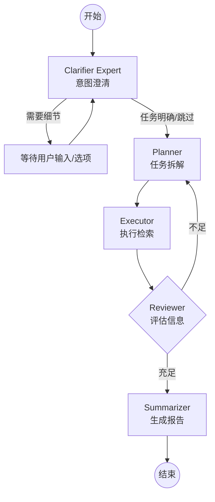

# Agentic RAG 研究助手

本项目是一个基于 **LangGraph** 和 **DeepSeek** 构建的高级 Agentic RAG（检索增强生成）系统。它能够自动通过引导对话细化用户课题，拆解研究任务，利用本地向量数据库（FAISS）检索 Excel 规格书，并结合互联网搜索（Tavily）迭代生成研究报告。

## 🌟 核心特性

- **交互式查询引导 (Clarifier Expert)**：新增专家节点，在研究开始前评估课题具体性。针对模糊课题，自动提供 3-4 个专业引导选项供用户补充细节。
- **多 Agent 协作**：采用 LangGraph 构建，包含 Clarifier、Planner、Executor、Reviewer 和 Summarizer 节点，实现从意图理解到报告生成的闭环。
- **混合检索**：
  - **本地搜索**：基于 FAISS 和 `BAAI/bge-small-zh-v1.5` 嵌入模型，对 Excel 规格书（式样书）进行语义检索。
  - **网络搜索**：集成 Tavily Search API 获取实时互联网信息。
- **自我反思与迭代**：Reviewer 评估信息充足性，自动决定是继续补充检索还是结束生成。

## 🏗 架构图



## 🛠 技术栈

- **框架**: LangChain, LangGraph
- **大模型**: DeepSeek (deepseek-chat)
- **向量数据库**: FAISS
- **嵌入模型**: HuggingFace (BAAI/bge-small-zh-v1.5)
- **数据处理**: Pandas, Openpyxl, Pillow (用于流程图显示)

## 🚀 快速开始

### 1. 环境准备
```bash
pip install -r requirements.txt
```

### 2. 配置环境变量 (.env)
```env
DEEPSEEK_API_KEY=your_key
TAVILY_API_KEY=your_key (可选)
```

### 3. 数据准备
放置 `Ballista_仕様書リスト.xlsx` 于根目录。首次运行将自动初始化 `faiss_index`。

### 4. 运行
```bash
python main.py
```

## 📂 项目结构
```text
├── app/
│   ├── core/
│   │   ├── graph.py    # LangGraph 工作流定义 (含 Clarifier 逻辑)
│   │   └── nodes.py    # 各 Agent 节点实现 (LLM 提示词)
│   ├── tools/
│   │   └── search.py   # FAISS 检索与 Tavily 搜索
│   └── state.py        # 全局 AgentState 定义
├── main.py             # 交互式 CLI 入口 (支持引导选项选择)
└── requirements.txt    # 依赖项
```

## 📜 许可证

本项目遵循 MIT 许可证。
